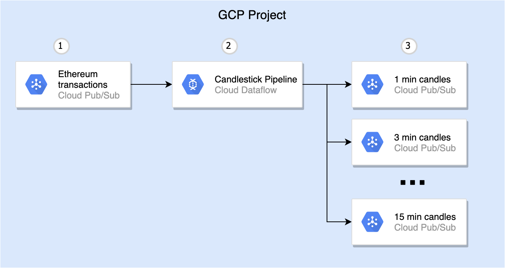

# Blockchain Streaming Analytics

Pipeline in this repo aggregates Ethereum transactions to candlestick records over defined windows
and publishes results to PubSub topics.



## How to run

### Create output topics manually
Where:
-  "ethereum_candles_" - topic prefix, default value of the `--outputTopicsPrefix` pipeline option;
- "60", "180", "300", "900" - aggregation windows in seconds, default value of the `--aggregationWindowsInSeconds` pipeline options.
  
```shell script
gcloud pubsub topics create ethereum_candles_60
gcloud pubsub topics create ethereum_candles_180
gcloud pubsub topics create ethereum_candles_300
gcloud pubsub topics create ethereum_candles_900
```

Note: we might refactor later to durations in ISO-8601 notation e.g. - PT1M, PT3M etc.

### Build pipeline

```shell script
mvn clean package
```

### Start pipeline locally
```shell script
export PROJECT=$(gcloud config get-value project 2> /dev/null)
java -cp target/blockchain-streaming-analytics-bundled-0.1.jar io.blockchainetl.streaming.candlestick.CandlestickPipeline \
  --runner=DirectRunner \
  --project=$PROJECT \
  --inputDataTopicOrSubscription=projects/$PROJECT/subscriptions/crypto_ethereum.transactions
```

### Or start pipeline in GCP with Dataflow runner
```shell script
export PROJECT=$(gcloud config get-value project 2> /dev/null)
java -cp target/blockchain-streaming-analytics-bundled-0.1.jar io.blockchainetl.streaming.candlestick.CandlestickPipeline \
  --runner=org.apache.beam.runners.dataflow.DataflowRunner \
  --project=$PROJECT \
  --inputDataTopicOrSubscription=projects/$PROJECT/subscriptions/crypto_ethereum.transactions
```
